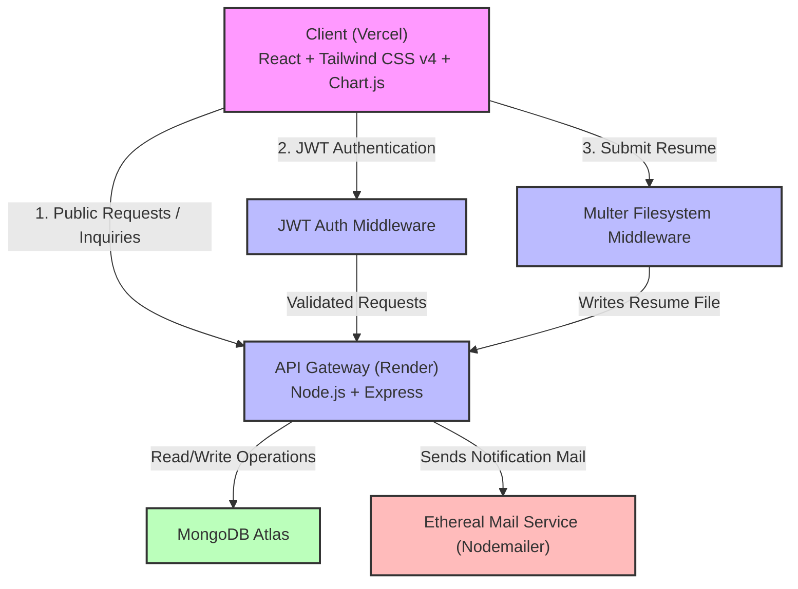
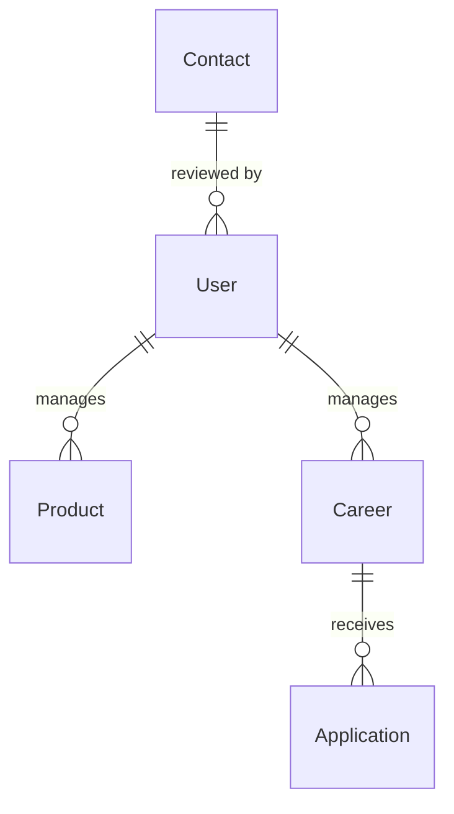

# TrialShopy Company Portfolio & Smart AR Try-On Platform

<!-- Repository Badges -->
<div align="center">

[](https://trialshopy-frontend-indol.vercel.app/)
[](https://trialshopy-backend-ft7n.onrender.com)
[](https://trialshopy-backend-ft7n.onrender.com/api-docs/)
[](https://github.com/nawalkant145/trialshopy-company-portfolio)

</div>

---

A premium, production-grade MERN Stack Company Portfolio & Interactive AR Try-on Platform developed for **TrialShopy** (an AI-powered augmented reality fashion shopping platform). This application serves as a comprehensive company portfolio, an interactive product catalog with virtual try-on simulation, a careers portal with secure document submission, and a high-performance administration dashboard with dynamic Chart.js analytics.

---

## 🔗 Quick Links

| Target | Production URL | Description |
| :--- | :--- | :--- |
| **Live Frontend** | [https://trialshopy-frontend-indol.vercel.app/](https://trialshopy-frontend-indol.vercel.app/) | The production-ready client application hosted on Vercel. |
| **API Server Gateway** | [https://trialshopy-backend-ft7n.onrender.com](https://trialshopy-backend-ft7n.onrender.com) | The Node.js/Express API server hosted on Render. |
| **Interactive Swagger Explorer** | [https://trialshopy-backend-ft7n.onrender.com/api-docs/](https://trialshopy-backend-ft7n.onrender.com/api-docs/) | Real-time OpenAPI interactive documentation. |
| **Submission Specifications** | [SUBMISSION.md](./SUBMISSION.md) | Dedicated document detailing all submission checklists. |

---

## ⚡ Key Highlights & Core Features

*   **Premium Visual Design:** Built using **Tailwind CSS v4** utility architecture. Features a curated primary (orange) and accent (purple) color scheme, modern Outfit/Inter typography, blur backdrop filters (glassmorphism), dynamic background gradient orbs, and smooth micro-animations.
*   **Fully Responsive & Accessible:** Fully optimized for mobile, tablet, and widescreen desktop layouts with fluid drawer navigation overlays and accessible screen readability.
*   **Auto-Seeding Database Config:** Automatically populates initial collections upon the first backend connection to MongoDB Atlas with 10 products, 5 team members (including Founder Nikhil Choudhary), 4 career openings, 3 customer testimonials, and a default administrator user if the database is empty.
*   **Immersive AR Try-On Catalog:** Users can browse products by categories (All, Outerwear, Shirts, Pants, Footwear, Athletic, Dresses). Each card provides details and launches an interactive AR try-on viewport mockup.
*   **Careers Portal with Resume Uploads:** Integrated candidate application form utilizing **Multer** for multipart binary file processing (PDF/Word resume attachments).
*   **Admin Dashboard Analytics:** Custom dashboard containing key KPI counters and interactive **Chart.js** data visualizations (Bar chart for traffic counts and Doughnut chart for database distribution metrics).
*   **Email Inquiry Notifications:** Submitting the contact form handles contact state tracking and fires email confirmation notifications using **Nodemailer** (integrated with Ethereal email services for instant preview generation in logs).
*   **Swagger OpenAPI Documentation:** Comprehensive endpoints mapping generated dynamically with `swagger-jsdoc` and interactive testing UI with `swagger-ui-express`.
*   **Security & Session Guardrails:** Visitor counter increments are session-guarded (`sessionStorage`) to prevent traffic data inflation. Admin endpoints are fully protected client-side and backend-side using **JSON Web Token (JWT)** checks.

---

## 🏗️ System Architecture

The diagram below outlines the communication flow between the frontend application, the backend API server, and third-party systems.



---

## 🔑 Default Credentials

The database auto-seeds a default administrator account upon initial backend connection:

*   **Email:** `admin@trialshopy.com`
*   **Password:** `Admin@123`

---

## 🛠️ Technology Stack

| Layer | Technology | Description |
| :--- | :--- | :--- |
| **Frontend** | React v18, Vite, Tailwind CSS v4, React Router v7, React Helmet Async, Chart.js, Axios | Dynamic component framework, high-performance styling, and charting library. |
| **Backend** | Node.js, Express, Mongoose (MongoDB), JWT, Multer, Nodemailer | API server, schema modeling, token security, and file uploading. |
| **Documentation** | Swagger JSDoc, Swagger UI Express | Dynamic API cataloging conforming to OpenAPI specifications. |
| **Database** | MongoDB Atlas (Cloud) / Local MongoDB | NoSQL document-based data store. |

---

## 🗄️ Database Schemas & Data Model

The application uses MongoDB with Mongoose object modeling. The collections are organized as follows:



### Collection Fields & Types

#### 1. User Schema (Admin Auth)
*   `email` (String, Required, Unique, Lowercase, Trimmed)
*   `password` (String, Required, Bcrypt hashed)
*   *Timestamps* (`createdAt`, `updatedAt`)

#### 2. Product Schema (Catalog)
*   `name` (String, Required, Trimmed)
*   `description` (String, Required)
*   `category` (String, Required, Trimmed)
*   `price` (Number, Required)
*   `imageUrl` (String, Required)
*   `tryOnLink` (String, Optional)
*   *Timestamps* (`createdAt`, `updatedAt`)

#### 3. Career Schema (Job Openings)
*   `title` (String, Required, Trimmed)
*   `department` (String, Required, Trimmed)
*   `location` (String, Required, Trimmed)
*   `description` (String, Required)
*   `requirements` (Array of Strings)
*   *Timestamps* (`createdAt`, `updatedAt`)

#### 4. Application Schema (Job Applications)
*   `name` (String, Required, Trimmed)
*   `email` (String, Required, Lowercase, Trimmed)
*   `careerId` (ObjectId, Ref: `Career`, Required)
*   `resumePath` (String, Required - path to uploaded PDF/Word file)
*   `status` (String, Enum: `['Pending', 'Reviewed', 'Shortlisted', 'Rejected']`, Default: `'Pending'`)
*   *Timestamps* (`createdAt`, `updatedAt`)

#### 5. Contact Schema (User Inquiries)
*   `name` (String, Required, Trimmed)
*   `email` (String, Required, Lowercase, Trimmed)
*   `message` (String, Required)
*   `status` (String, Enum: `['Pending', 'Resolved']`, Default: `'Pending'`)
*   *Timestamps* (`createdAt`, `updatedAt`)

#### 6. TeamMember Schema (Profiles)
*   `name` (String, Required, Trimmed)
*   `role` (String, Required, Trimmed)
*   `category` (String, Enum: `['founder', 'core', 'advisor']`, Default: `'core'`)
*   `bio` (String, Required)
*   `imageUrl` (String, Required)
*   *Timestamps* (`createdAt`, `updatedAt`)

#### 7. Testimonial Schema (Client Feedback)
*   `name` (String, Required, Trimmed)
*   `role` (String, Required, Trimmed)
*   `message` (String, Required)
*   `rating` (Number, Required, Min: 1, Max: 5, Default: 5)
*   `imageUrl` (String, Required)
*   *Timestamps* (`createdAt`, `updatedAt`)

#### 8. Stats Schema (Visitor Counter)
*   `key` (String, Required, Unique, Default: `'global'`)
*   `visitorsCount` (Number, Default: 0)
*   *Timestamps* (`createdAt`, `updatedAt`)

---

## 📡 API Endpoints Reference

| Route | Method | Access | Description |
| :--- | :--- | :--- | :--- |
| `/api/auth/login` | `POST` | Public | Authenticates admin credentials and returns a JWT token. |
| `/api/products` | `GET` | Public | Retrieves all product items from the catalog. |
| `/api/products` | `POST` | Admin | Creates a new product catalog item. |
| `/api/products/:id` | `PUT` | Admin | Updates an existing product. |
| `/api/products/:id` | `DELETE` | Admin | Deletes a product catalog item. |
| `/api/careers` | `GET` | Public | Retrieves all active job openings. |
| `/api/careers/apply` | `POST` | Public | Submits a job application (handles Multer multipart upload). |
| `/api/careers/applications`| `GET` | Admin | Retrieves all applications (populates job details). |
| `/api/careers/:id` | `POST`/`PUT`/`DELETE` | Admin | CRUD operations for job openings. |
| `/api/contacts` | `POST` | Public | Submits a contact inquiry (sends Nodemailer notification). |
| `/api/contacts` | `GET` | Admin | Retrieves contact inquiries. |
| `/api/contacts/:id` | `PUT` | Admin | Updates status of inquiry (e.g., marks as 'Resolved'). |
| `/api/team` | `GET` | Public | Retrieves all team profiles. |
| `/api/team` | `POST`/`PUT`/`DELETE` | Admin | CRUD operations for team members. |
| `/api/stats/increment-visitors` | `POST` | Public | Increments aggregate page visitor counter. |
| `/api/stats/dashboard` | `GET` | Admin | Aggregates stats metadata counts for dashboard visuals. |

---

## ⚙️ Local Development Setup

### Prerequisites
*   Node.js (v18 or higher recommended)
*   npm or yarn
*   MongoDB Atlas account or local MongoDB installation

### 1. Backend Server Setup
1.  Navigate to the backend directory:
    ```bash
    cd backend
    ```
2.  Install dependencies:
    ```bash
    npm install
    ```
3.  Create a `.env` file in the `backend/` directory:
    ```env
    PORT=5000
    MONGO_URI=mongodb://127.0.0.1:27017/trialshopy
    JWT_SECRET=super_secret_key_trialshopy_123
    CORS_ORIGIN=http://localhost:5173
    ```
4.  Start the server in development mode:
    ```bash
    npm run dev
    ```

### 2. Frontend Client Setup
1.  Navigate to the frontend directory:
    ```bash
    cd ../frontend
    ```
2.  Install dependencies:
    ```bash
    npm install
    ```
3.  Create a `.env` file in the `frontend/` directory:
    ```env
    VITE_API_URL=http://localhost:5000/api
    ```
4.  Run the development server:
    ```bash
    npm run dev
    ```
5.  Open your browser and navigate to `http://localhost:5173`.

---

## ☁️ Production Deployment Process

### 1. Database Configuration
1.  Create a free shared cluster on **MongoDB Atlas**.
2.  In Network Access, whitelist `0.0.0.0/0` (or configure specific static IPs if available) and create a database user with read/write credentials.
3.  Obtain your MongoDB Connection URI.

### 2. Backend Deployment (e.g., Render / Railway)
1.  Set the root directory configuration of your deployment to `backend`.
2.  Set the Build Command to `npm install`.
3.  Set the Start Command to `npm start`.
4.  Configure the following Environment Variables in the hosting dashboard:
    *   `MONGO_URI` = *(your MongoDB Atlas URI)*
    *   `JWT_SECRET` = *(a secure JWT secret key)*
    *   `CORS_ORIGIN` = `https://trialshopy-frontend-indol.vercel.app`

### 3. Frontend Deployment (e.g., Vercel)
1.  Set the root directory configuration of your deployment to `frontend`.
2.  Set the Framework Preset to `Vite` (Build Command: `npm run build`, Output Directory: `dist`).
3.  Configure the following Environment Variable:
    *   `VITE_API_URL` = `https://trialshopy-backend-ft7n.onrender.com/api`

---

## 📂 Project Directory Structure

```text
trialshopy-company-portfolio/
├── backend/
│   ├── config/          # Database connection & auto-seed script
│   ├── middleware/      # JWT auth guard & Multer file upload setup
│   ├── models/          # Mongoose database schemas
│   ├── routes/          # Express API controllers (with Swagger definitions)
│   ├── uploads/         # Candidate resume storage directory
│   ├── server.js        # Server entry point
│   └── package.json
├── frontend/
│   ├── src/
│   │   ├── components/  # Layout, Header, Footer, SEO Metadata, Loading Skeletons
│   │   ├── context/     # Global state context handlers (Auth, Theme)
│   │   ├── pages/       # Home, About, Features, How It Works, Products, Careers, Contact
│   │   │   └── Admin/   # Admin Login page, Dashboard Analytics, Content CRUD Control
│   │   ├── utils/       # Axios custom client configuration
│   │   ├── App.jsx      # Lazy-loaded route configurations
│   │   └── index.css    # Global stylesheet, animations, and Tailwind v4 theme variables
│   └── package.json
├── README.md
└── SUBMISSION.md
```

---

## 📝 Submission & Assessment Context

This repository and application are submitted for the **TrialShopy** assessment. All code, templates, mock-ups, endpoints, and deployment pipelines conform to the technical and design standards requested. For detailed assessment requirement mapping, refer to [SUBMISSION.md](./SUBMISSION.md).
