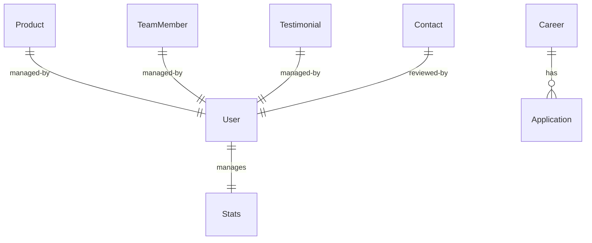

# TrialShopy Company Portfolio Website — Project Submission Details

This document maps all the required submission components for the **TrialShopy Company Portfolio Website** project. 

---

## 1. GitHub Repository
*   **Repository URL:** [https://github.com/nawalkant145/trialshopy-company-portfolio.git](https://github.com/nawalkant145/trialshopy-company-portfolio.git)
*   **Branch:** `main`
*   **Tech Stack:** MERN Stack (MongoDB, Express, React, Node.js) with Tailwind CSS v4.

---

## 2. Live Demo & Deployment Links
*   **Frontend Deployment Link (Vercel):** [https://trialshopy-frontend-indol.vercel.app/](https://trialshopy-frontend-indol.vercel.app/)
*   **Backend API Deployment Link (Render):** [https://trialshopy-backend-ft7n.onrender.com](https://trialshopy-backend-ft7n.onrender.com)
*   **Interactive Swagger Explorer:** [https://trialshopy-backend-ft7n.onrender.com/api-docs/](https://trialshopy-backend-ft7n.onrender.com/api-docs/)

---

## 3. Project Documentation

### Project Overview
A premium Company Portfolio Website built for **TrialShopy** (an AI-powered augmented reality fashion platform). The application allows users to explore products, learn about the company's vision and team, apply for job openings with resumes, and submit inquiries. It features a fully-functional admin panel with dynamic analytics visualizations.

### Core Features
*   **Modern Premium UI/UX:** Built using Tailwind CSS v4, custom gradient orbs, glassmorphism card components, and subtle micro-animations.
*   **Interactive Product Catalog:** Category filtering (All, Outerwear, Shirts, Pants, Footwear, Athletic, Dresses) with a detail modal and AR simulation launch trigger.
*   **Dynamic Admin Dashboard:** Real-time metrics visualization (visitor counts, applications, inquires) using Bar & Doughnut charts powered by **Chart.js**.
*   **CRUD Content Management:** Full administrative CRUD capabilities for Products, Careers, and Team Members.
*   **Auto-Seeding Database:** Automatically populates the database with demo products, team profiles, career openings, testimonials, and a default admin user on initial connection.
*   **Ethereal Mail Integration:** Submitting the contact form fires a Nodemailer system email and prints a real-time Ethereal email preview link in backend server logs.
*   **Visitor Session-Guard:** Visitor traffic metrics are session-guarded (`sessionStorage`) to prevent count inflation from refreshes.

---

## 4. Database Schema
The database uses MongoDB with Mongoose object modeling. The schemas are structured as follows:

### 1. User Schema (Admin Authentication)
*   **email** (String, Required, Unique, Lowercase, Trimmed)
*   **password** (String, Required, Bcrypt hashed)
*   *timestamps* (createdAt, updatedAt)

### 2. Product Schema (Catalog)
*   **name** (String, Required, Trimmed)
*   **description** (String, Required)
*   **category** (String, Required, Trimmed)
*   **price** (Number, Required)
*   **imageUrl** (String, Required)
*   **tryOnLink** (String, Optional)
*   *timestamps* (createdAt, updatedAt)

### 3. Career Schema (Job Openings)
*   **title** (String, Required, Trimmed)
*   **department** (String, Required, Trimmed)
*   **location** (String, Required, Trimmed)
*   **description** (String, Required)
*   **requirements** (Array of Strings)
*   *timestamps* (createdAt, updatedAt)

### 4. Application Schema (Job Applications)
*   **name** (String, Required, Trimmed)
*   **email** (String, Required, Lowercase, Trimmed)
*   **careerId** (ObjectId, Ref: `Career`, Required)
*   **resumePath** (String, Required - path to uploaded PDF/Word file)
*   **status** (String, Enum: `['Pending', 'Reviewed', 'Shortlisted', 'Rejected']`, Default: `'Pending'`)
*   *timestamps* (createdAt, updatedAt)

### 5. Contact Schema (User Inquiries)
*   **name** (String, Required, Trimmed)
*   **email** (String, Required, Lowercase, Trimmed)
*   **message** (String, Required)
*   **status** (String, Enum: `['Pending', 'Resolved']`, Default: `'Pending'`)
*   *timestamps* (createdAt, updatedAt)

### 6. TeamMember Schema (Profile)
*   **name** (String, Required, Trimmed)
*   **role** (String, Required, Trimmed)
*   **category** (String, Enum: `['founder', 'core', 'advisor']`, Default: `'core'`)
*   **bio** (String, Required)
*   **imageUrl** (String, Required)
*   *timestamps* (createdAt, updatedAt)

### 7. Testimonial Schema (Client Feedback)
*   **name** (String, Required, Trimmed)
*   **role** (String, Required, Trimmed)
*   **message** (String, Required)
*   **rating** (Number, Required, Min: 1, Max: 5, Default: 5)
*   **imageUrl** (String, Required)
*   *timestamps* (createdAt, updatedAt)

### 8. Stats Schema (Visitor Count)
*   **key** (String, Required, Unique, Default: `'global'`)
*   **visitorsCount** (Number, Default: 0)
*   *timestamps* (createdAt, updatedAt)

---

## 5. API Documentation
The backend incorporates Swagger OpenAPI documentation. The endpoints are exposed and documented as follows:

| Route | Method | Access | Description |
| :--- | :--- | :--- | :--- |
| `/api/auth/login` | `POST` | Public | Authenticates admin credentials; returns a JWT token. |
| `/api/products` | `GET` | Public | Retrieves all products. |
| `/api/products` | `POST` | Admin | Creates a new product catalog item. |
| `/api/products/:id` | `PUT` | Admin | Updates an existing product. |
| `/api/products/:id` | `DELETE` | Admin | Deletes a product catalog item. |
| `/api/careers` | `GET` | Public | Retrieves all job openings. |
| `/api/careers/apply` | `POST` | Public | Submits a job application (handles Multer multipart PDF/Word upload). |
| `/api/careers/applications`| `GET` | Admin | Retrieves all applications (populates job opening details). |
| `/api/careers/:id` | `POST`/`PUT`/`DELETE` | Admin | CRUD operations for job openings. |
| `/api/contacts` | `POST` | Public | Submits a contact inquiry (sends Nodemailer email). |
| `/api/contacts` | `GET` | Admin | Retrieves contact inquiries. |
| `/api/contacts/:id` | `PUT` | Admin | Updates status of inquiry (e.g. marks as 'Resolved'). |
| `/api/team` | `GET` | Public | Retrieves all team profiles. |
| `/api/team` | `POST`/`PUT`/`DELETE` | Admin | CRUD operations for team members. |
| `/api/stats/increment-visitors` | `POST` | Public | Increments aggregate page visitor counter. |
| `/api/stats/dashboard` | `GET` | Admin | Aggregates stats metadata counts for dashboard visuals. |
